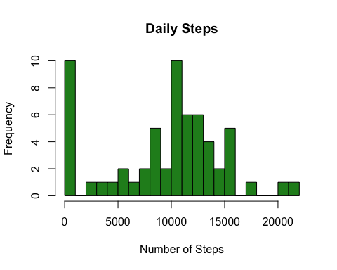
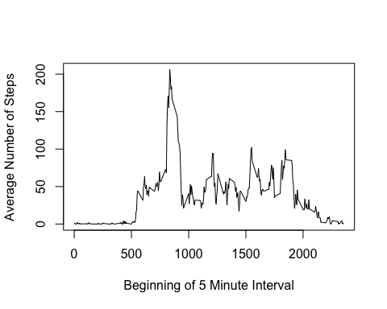
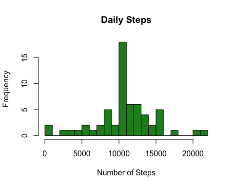

# Reproducible Research: Peer Assessment 1


## Loading and preprocessing the data

1. Reading in the data.

```r
unzip("activity.zip")
data<-read.table("activity.csv",sep=",",na.strings="NA",
                 nrows=17600,header=T)
```

2. Processing the time incase it is necessary.

```r
# - fixing up the dates - #
data$Day<-strptime(data$date,"%Y - %m - %d")
```

## What is mean total number of steps taken per day?

1. 
First we will find the total steps taken per day.  We are excluding the NA values.  Then we will calculate the mean and median and round them to one decimal point.


```r
dailysteps<-with(data,tapply(steps,date,sum,na.rm=T))
```

2. A histogram of the total number of steps taken each day.


```r
hist(dailysteps,col="forestgreen",breaks=20, xlab="Number of Steps",
     main="Daily Steps")
```



3. Calculating the mean and median of the toal number of steps taken per day.


```r
meanstep<-round(mean(dailysteps,na.rm=T),1)
medianstep<-median(dailysteps,na.rm=T)
```

The **mean** number of steps taken per day 9354.2 and the **median** number of steps per day is 10395.  

## What is the average daily activity pattern?


1. Time series plot of the 5-minute interval and the average number of steps taken, averaged across al days.


```r
intervalsteps<-tapply(data$steps,data$interval,mean,na.rm=T)
intervals<-unique(data$interval)
plot(intervals,intervalsteps,type="l",xlab="Beginning of 5 Minute Interval",
     ylab="Average Number of Steps")
```



2. The 5 minute interval with the average maximum number of steps is found by:


```r
m<-max(intervalsteps)
maxsteps<-intervals[intervalsteps==m]
roundm<-round(m,1)
```

The interval beginning at minute 835 has the **maximum average** steps.  The **maximum** is an average of 206.2 steps.

## Imputing missing values

1. Calculate and report the number of missing values in the dataset.

```r
nmissing<-sum(is.na(data$steps))
```

There are 2304 missing values in the dataset.

2.  Devise a strategy for filling in all of the missing values in the dataset.

I will **impute** the average 5-minute value for all missing values.

3. I have merged in the average for each 5-minute interval and then replaced missing values by the average.


```r
avedat<-data.frame(interval=intervals,meansteps=intervalsteps)
data2<-merge(data,avedat,by="interval")
data2$steps[is.na(data2$steps)]<-data2$meansteps[is.na(data2$steps)]
```

4. Make a histogram of the total number of steps each day and calculate the mean and median.


```r
dailysteps2<-with(data2,tapply(steps,date,sum,na.rm=T))
hist(dailysteps2,col="forestgreen",breaks=20, xlab="Number of Steps",
     main="Daily Steps")
```



```r
meanstep2<-round(mean(dailysteps2,na.rm=T),1)
medianstep2<-round(median(dailysteps2,na.rm=T),1)
```

The **mean** number of steps taken per day 10766.2 and the **median** number of steps per day is 10766.2.   This has raised both the median and the mean.  This imputation procedure has resulted in shifing many of the zeroes towards the mean of the distribution.


## Are there differences in activity patterns between weekdays and weekends?

1. Create a new factor variable for weekdays and weekends.


```r
data2$DoW<-weekdays(data2$Day)
data2$Weekend<-with(data2,DoW=="Saturday" | DoW=="Sunday")
data2$Weekend<-factor(data2$Weekend,labels=c("weekday", "weekend"))
with(data2,table(DoW,Weekend))
```

```
##            Weekend
## DoW         weekday weekend
##   Friday       2592       0
##   Monday       2592       0
##   Saturday        0    2304
##   Sunday          0    2304
##   Thursday     2592       0
##   Tuesday      2592       0
##   Wednesday    2592       0
```

2. Make a panel plot containing time series of the average steps by weekday and weekend.


```r
# intervalsteps<-with(mapply(data2$steps,data$interval,mean,na.rm=T)
# intervals<-unique(data$interval)
# plot(intervals,intervalsteps,type="l",xlab="Beginning of 5 Minute Interval",
#      ylab="Average Number of Steps")
```


